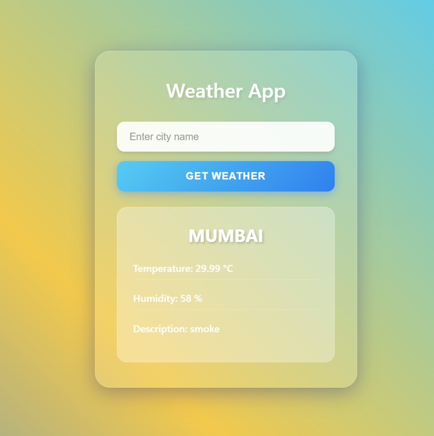

# 🌦️ Weather App – CLI + Flask UI

A simple and beginner-friendly project where I built:

✔ A **Weather CLI tool** (Python)  
✔ A **Flask-based Web UI** for weather lookup  
✔ **API integration** using OpenWeather  
✔ **Pytest test cases** for the CLI  
✔ Proper folder structure + error handling

This project helped me understand API calls, CLI arguments, Flask routing, and basic testing with Pytest.

---




## 🚀 Features

### ✅ **1. Weather CLI Tool**

- Fetches **real-time weather** using OpenWeather API
- Shows **temperature, humidity & description**
- Handles invalid/no city input
- Easy to run from terminal

### ✅ **2. Simple Flask Web App**

- Clean UI where user enters city name
- Displays:
  - Temperature (°C)
  - Humidity (%)
  - Weather description
- Includes error message for invalid cities

### ✅ **3. Pytest Test Cases**

- Tests API response format
- Tests CLI behavior
- Ensures weather data extraction works properly

---

## 🛠️ Tech Stack

- **Python 3.x**
- **Flask**
- **Requests**
- **Pytest**
- **OpenWeather API**

---

## 📌 How to Run the CLI

```bash
python weather.py mumbai
```

## 📌 How to Run the Flask App

```bash
python app.py
```

## 🧪 Run Tests

```bash
pytest -s
```
