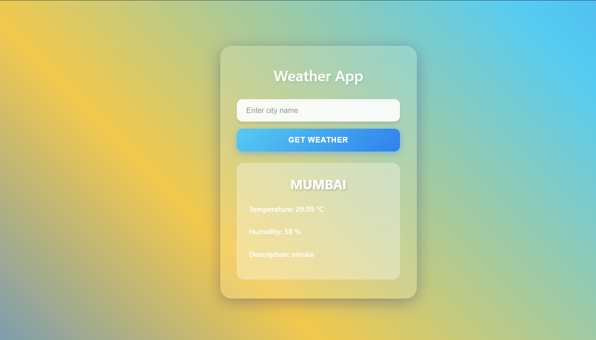
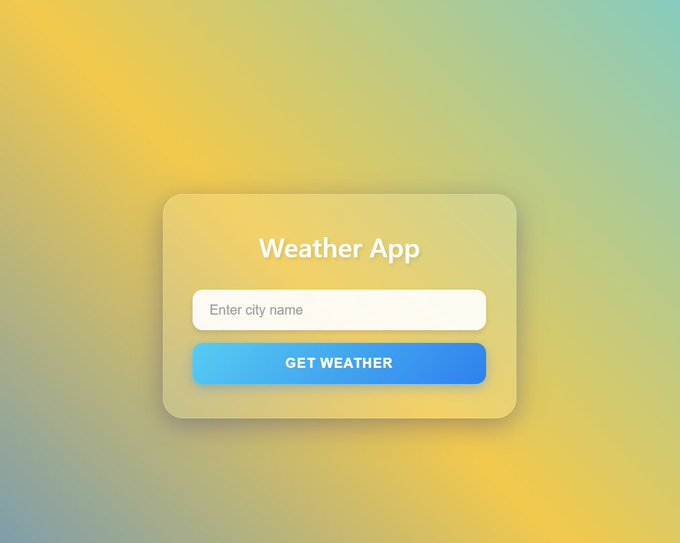

# Weather CLI Project

# What I built:

• A Weather CLI tool → fetches real-time weather using OpenWeather API
• A minimal Flask web UI → enter city → see temperature, humidity, description
• Added error handling & structured folder setup
• Wrote test cases for the CLI using pytest

#
